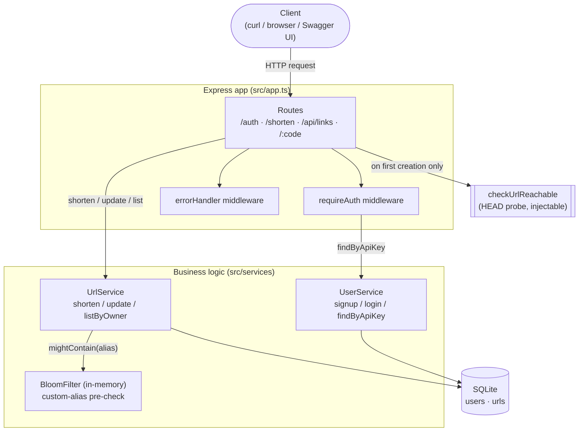
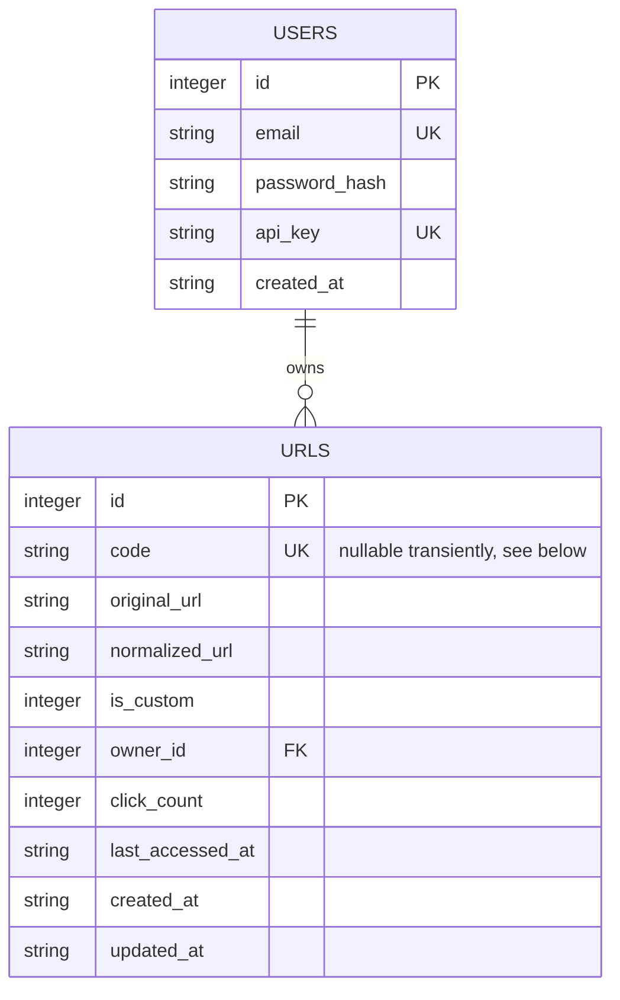
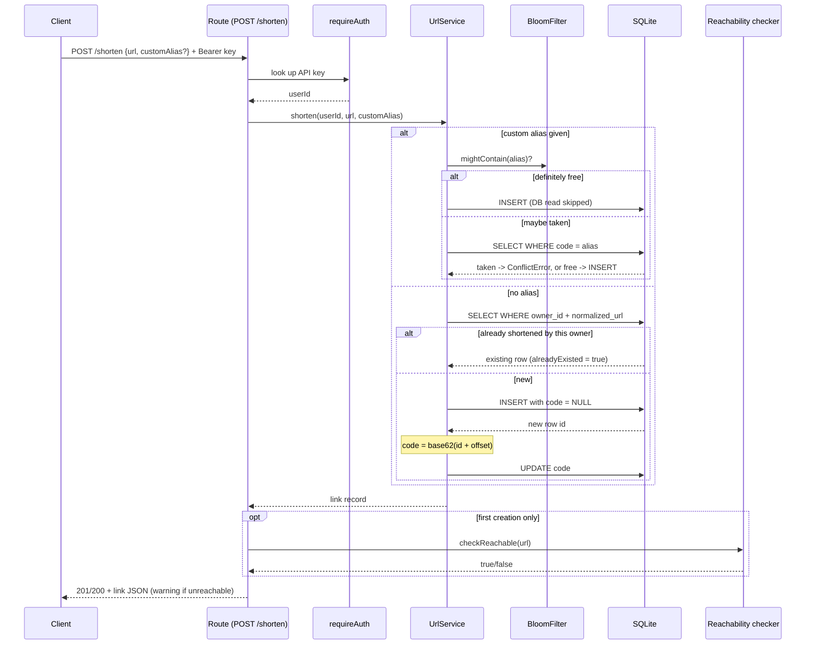
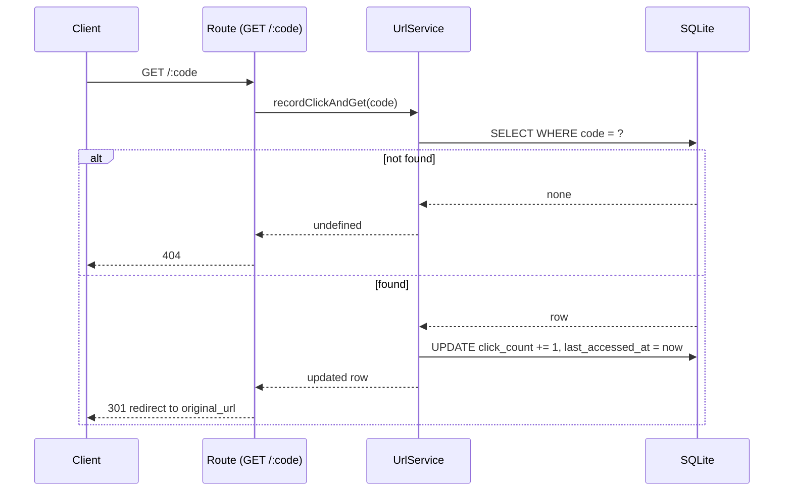

# URL Shortener & Link Analytics

A URL shortener with per-user accounts, custom aliases, per-link click analytics, and a
provably collision-free short-code generator. Node.js + TypeScript + Express + SQLite
(`better-sqlite3`).

- **Interactive API docs:** `GET /docs` (Swagger UI) once the server is running.
- **Raw spec:** `GET /openapi.json`.

## Contents

- [Install & run](#install--run)
- [Test credentials](#test-credentials)
- [Architecture](#architecture)
- [Data model](#data-model)
- [API reference](#api-reference)
- [Key workflows](#key-workflows)
- [Design decisions](#design-decisions)
- [Test](#test)
- [Project structure](#project-structure)
- [What's missing / next steps](#whats-missing--next-steps)

## Install & run

Requires Node 18+ (built with Node 22).

```bash
npm install
npm run dev        # dev server with auto-reload, http://localhost:3000
```

For a production-style run:

```bash
npm run build
npm start
```

The SQLite file is created automatically at `data/urls.sqlite` (override with the
`DATABASE_PATH` env var). Other env vars: `PORT` (default `3000`), `BASE_URL` (used to
build the `shortUrl` field in responses; default `http://localhost:<PORT>`).

## Test credentials

A demo account is seeded automatically on every server startup (idempotent — safe to
restart), so you can try the API immediately without signing up first:

```
email:    demo@example.com
password: demo12345
```

```bash
curl -X POST http://localhost:3000/auth/login \
  -H "Content-Type: application/json" \
  -d '{"email":"demo@example.com","password":"demo12345"}'
# -> { "apiKey": "..." } — use as `Authorization: Bearer <apiKey>` on subsequent requests
```

This is a dev/demo convenience (`src/seed.ts`) — not something a real deployment should
ship with a hardcoded password for.

## Architecture



Every layer is a plain constructor taking the SQLite handle (`UserService(db)`,
`UrlService(db)`) — no framework-level DI container, no globals. `createApp(db, baseUrl,
checkReachable)` wires it all together, which is also how tests swap in an in-memory DB
and a stub reachability checker without touching real network or disk.

## Data model



Indexes: `(owner_id, normalized_url)` for the per-owner dedupe lookup, `(owner_id)` for
dashboard listing. See [Design decisions](#design-decisions) for why `code` is nullable.

## API reference

All bodies are JSON. Full request/response schemas: `GET /openapi.json` or `GET /docs`.

| Method  | Path                | Auth | Purpose                                    |
|---------|---------------------|------|---------------------------------------------|
| POST    | `/auth/signup`      | —    | Create an account, get an API key           |
| POST    | `/auth/login`       | —    | Re-fetch the same API key                   |
| POST    | `/shorten`          | ✅   | Create a short link (auto code or alias)    |
| GET     | `/:code`            | —    | 301 redirect, increments click count        |
| GET     | `/api/links`        | ✅   | List the caller's own links                 |
| GET     | `/api/links/:code`  | ✅   | One of the caller's own links               |
| PATCH   | `/api/links/:code`  | ✅   | Update a link's destination URL             |
| GET     | `/health`           | —    | Liveness check                              |

Send the API key as `Authorization: Bearer <apiKey>` on every ✅ route.

<details>
<summary><strong>POST /auth/signup</strong></summary>

```json
{ "email": "you@example.com", "password": "at least 8 chars" }
```

→ `201 { "apiKey": "..." }`. `409` if the email is already registered, `400` for an
invalid email or a password under 8 characters.
</details>

<details>
<summary><strong>POST /auth/login</strong></summary>

```json
{ "email": "you@example.com", "password": "..." }
```

→ `200 { "apiKey": "..." }` (the same key issued at signup). `401` on bad credentials.
</details>

<details>
<summary><strong>POST /shorten</strong></summary>

```json
{ "url": "https://example.com/some/long/path", "customAlias": "optional-alias" }
```

→ `201` (new link) or `200` (idempotent — same user already shortened this URL):

```json
{
  "code": "4c93",
  "shortUrl": "http://localhost:3000/4c93",
  "originalUrl": "https://example.com/some/long/path",
  "isCustom": false,
  "clickCount": 0,
  "createdAt": "2026-07-14 19:10:59",
  "updatedAt": null,
  "lastAccessedAt": null,
  "alreadyExisted": false
}
```

`400` for an invalid URL or malformed alias, `409` if `customAlias` is already taken. A
`"warning"` field may be present (see [Design decisions](#design-decisions)) without
affecting the status code.
</details>

<details>
<summary><strong>GET /:code</strong></summary>

`301` redirect to the original URL, click count incremented. `404` for an unknown code.
</details>

<details>
<summary><strong>GET /api/links</strong></summary>

→ `200 { "links": [ ...same shape as the shorten response, minus "alreadyExisted" ] }`
</details>

<details>
<summary><strong>GET /api/links/:code · PATCH /api/links/:code</strong></summary>

`GET` returns the link detail. `PATCH` body: `{ "url": "https://new-destination" }` →
returns the updated link (code/owner/click count unchanged). Both return `404` — not
`403` — if the code doesn't exist *or* belongs to someone else, so a non-owner can't
distinguish "not yours" from "doesn't exist."
</details>

## Key workflows

**Creating a short link:**



**Visiting a short link:**



## Design decisions

**Short codes can't collide.** Generated codes are a base62 encoding of the row's own
SQLite `AUTOINCREMENT` id (offset by a constant, purely to avoid tiny codes like `"1"`).
Base62 encoding is a bijection — a positional-numeral-system conversion — so two
different ids can never encode to the same string. Since the id is already guaranteed
unique by the primary key, the code is too, by construction rather than by
random-and-hope. See `src/utils/base62.ts` and its round-trip/no-duplicates tests.

**Custom aliases use a Bloom filter, backed by a DB constraint.** A small self-built
Bloom filter (`src/utils/bloomFilter.ts`) is rebuilt from existing custom codes on
startup. On a new alias request: if the filter says "definitely not present," the DB
existence check is skipped entirely (fast path). If it says "maybe present," a DB read
confirms it. Either way, the `UNIQUE(code)` constraint is the actual correctness
guarantee — a Bloom filter alone can't safely enforce uniqueness (false positives, no
deletion), so it's used only to avoid an unnecessary read, never as the source of truth.

**`urls.code` is nullable, but only transiently.** A generated code is derived from the
row's own id, so the row is inserted with `code = NULL` and updated once the id is
known. SQLite treats each `NULL` in a `UNIQUE` index as distinct from every other value
(including other `NULL`s), so this never collides with a real code, and the insert →
update happens synchronously with no `await` in between — no other request can observe
the intermediate `NULL` state.

**Duplicate URLs are deduplicated per owner, not globally.** Shortening a URL you've
already shortened returns your existing code (`200`, idempotent) instead of creating a
new row. Two different users shortening the same URL get independent codes and
independent click counts — handing user B a code owned by user A would put an entry on
B's dashboard for a link they don't actually control. A custom-alias request always
creates a new row, since picking a name is explicit intent.

**Auth is a plain API key, not JWT.** Signup hashes the password with `bcryptjs` and
issues a random 48-char hex key; login re-issues the same key. No sessions, no
expiry/refresh. Deliberate scope trade-off: real accounts with hashed passwords, without
building a token-refresh story for a take-home.

**Reachability warning, not a hard validation error.** `POST /shorten` still requires a
syntactically valid `http`/`https` URL (`400` otherwise). Separately, on first creation
it probes the destination once (`HEAD`, ~3s timeout, dependency-injected so tests never
hit the network). If the destination doesn't respond, the link is still created — the
response just includes a `warning` field. Any actual HTTP response (even `404`/`500`)
counts as reachable; only a network-level failure counts as unreachable. In a real
deployment this outbound probe would need an allowlist/deny-private-IP step to avoid
SSRF — noted here rather than built, given scope.

## Test

```bash
npm test            # all unit + integration tests (Jest + supertest)
npm run test:watch
```

Unit tests use an in-memory SQLite database (`:memory:`); integration tests exercise the
full Express app through `createApp()`. No test makes a real network call — the
reachability checker is dependency-injected and stubbed everywhere it's exercised.

## Project structure

```
src/
  db.ts                  SQLite schema + connection
  errors.ts              Typed errors mapped to HTTP status by middleware/errorHandler
  types.ts               Shared row types
  openapi.ts              OpenAPI 3.0 document served at /openapi.json and /docs
  seed.ts                 Idempotent demo-account seeding
  utils/                  base62, URL validation/normalization, Bloom filter, reachability
  auth/                   password hashing, API key generation
  services/               userService, urlService (all business logic)
  middleware/             requireAuth, errorHandler
  routes/                 auth, links (shorten/dashboard/update), redirect
  app.ts / server.ts      Express wiring / bootstrap
tests/
  unit/                   one file per module, in-memory DB, no network calls
  integration/            full app.ts flow via supertest
```

## What's missing / next steps

See the write-up (`WRITEUP.md`) for the fuller list, but briefly: no rate limiting, no
API-key rotation, the reachability probe has no SSRF hardening, short codes are still
sequentially guessable (an attacker can enumerate low ids) since obscuring that was out
of scope here, and there's no frontend — the "dashboard" is a JSON API only.
